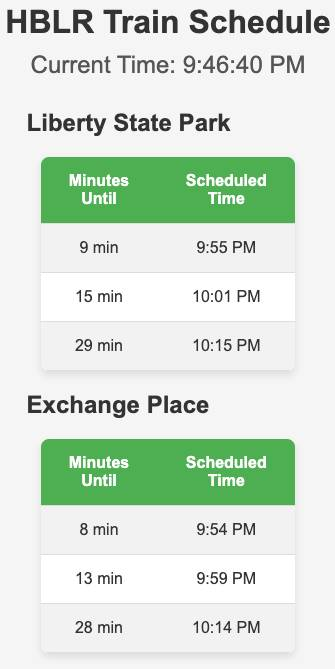

# Hudson-Bergen Light Rail Scheduler

Really basic, simple project that took a few hours where I wanted to do 2 things: test out some of the new AI coding tools and create an HTML page that tells me when the next 3 arriving Hudson-Bergen Light Rail (HBLR) trains are coming for the two stops I care about, Exchange Place and Liberty State Park.

## History

What I really wanted was a live countdown clock for the HBLR. I registered for a developer account with NJ Transit and downloaded their GTFS Feeds for Rail but there's no HBLR data in there. It's mapped out in their protobufs but the live feed does not have the data.

The stations themselves have countdown clocks but they don't work at least 50% of the time, and it doesn't help me when I'm deciding to leave my apartment. Google Maps does tell you the next scheduled train but it's buried in 500 other details I don't care about, I just want to know when the next 3 arriving trains are.

So I opted to go with a program that just loads the schedule and calculates when the next 3 trains for for LSP and Exchange Place.

## Getting the data

Originally I downloaded the color-coded PDF that NJ transit offers and spent hours manually converting that into a JSON file. Except in 4 places that schedule has gaps for the weekday trains, just saying each train may then arrive in 10, 15 or 20 minute increments for the next few hours. How is that helpful? Why bother writing down the exact times and then skipping 4 chunks of the day? Makes no sense.

So after wasting my time handcoding all those times and writing a function to fill in the 4 gaps for weekdays, weekends, 2 stations, 2 directions, I then stumbled upon https://www.njtransit.com/light-rail-to, which will just print out all the scheduled departure times in a well-defined text format.

I converted tall those into an integer array in 24-hour time, just to reduce the chance of errors. It doesn't say if trains are Bayonne-Hoboken or Tonnelle-West Side but that doesn't matter for my purposes.

## Writing the code

I asked ChatGPT to write almost all of it and for this purpose it did a pretty good job. I tweaked a few things but it saved me a ton of time and effort. It's set to self-update the values every 5 seconds and works exactly as I want it to.

## To use this

To use this yourself you'd have to get all the departure times for the stations you want via https://www.njtransit.com/light-rail-to and convert them into an integer array that sees the PM values as 24-hour. 

Technically you could rewrite the code to interpret AM/PM values but I feel like the 24-hour clock is an easier mental model.

Mostly I wouldn't expect others to use this just storing it for historical reference.

